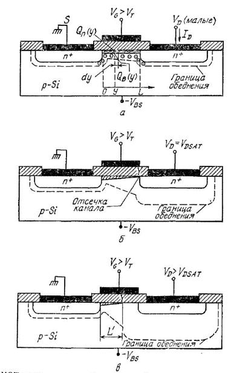
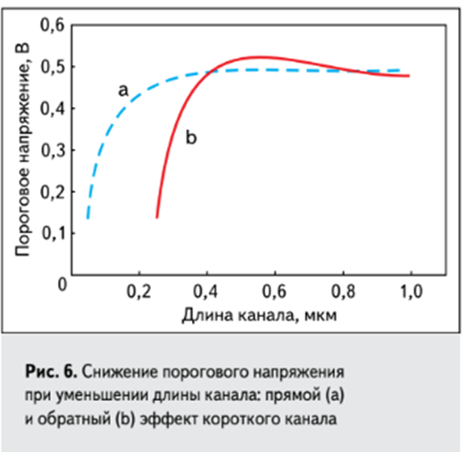
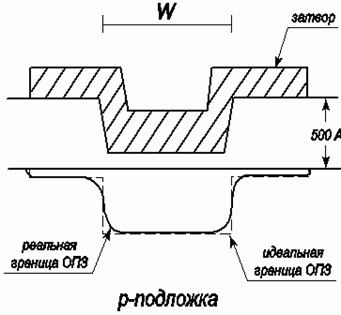
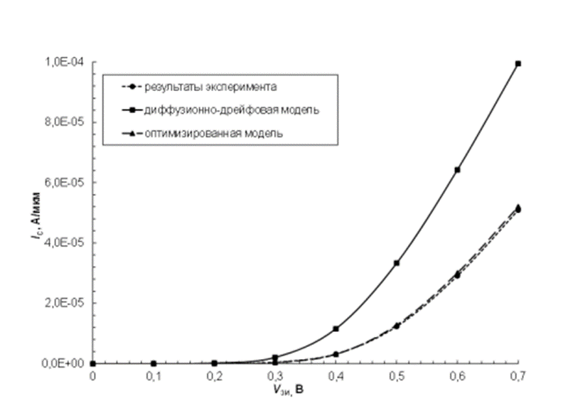
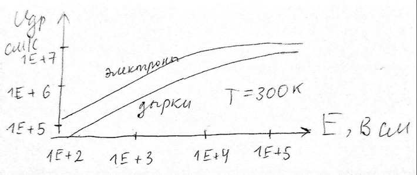
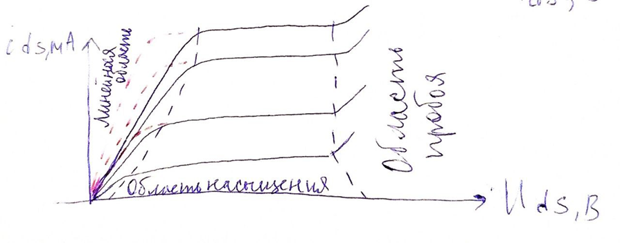
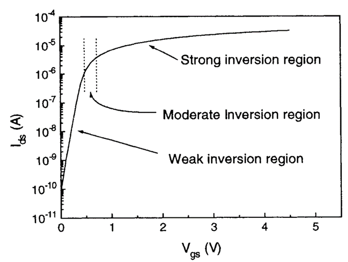

# Общие сведения

{height=300}

## Синонимы:

- Канал - инверсный слой 
  
- ОПЗ - ОО (область пространственного заряда - обедненная область) 

# Список эффектов

## 1. Модуляция длины канала (CLM)

#q - вставить из файла

[BSIM Channel Length Modulation (CLM)](https://class.ece.iastate.edu/djchen/ee501/BSIM470_Manual.pdf#page=41)

## 2. Перекрытие обедненных областей истока и стока

В длинноканальном транзисторе заряд под затвором представляет собой сумму зарядов областей пространственного заряда р-n-переходов и области обеднения под затвором. При уменьшении длины канала все три области пространственных зарядов перекрываются, поэтому для обеспечения той же величины суммарного заряда под затвором, что и в длинноканальном транзисторе (при неизменном заряде затвора), заряд инверсионного слоя короткоканального транзистора должен быть больше, т. е. пороговое напряжение уменьшается. 

Другими словами - нужно приложить меньшее по модулю напряжение на затвор короткоканального транзистора, чтобы образовался канал.

Описанный эффект является существенно двумерным, что усложняет уравнения компактной модели, в том числе зависимость характеристик от длины канала

{height=300}

## 3. Прокол между истоком и стоком

Если МОП-транзистор заперт, а напряжение на его стоке возрастает, то область пространственного заряда стока распространяется в сторону истока. Поскольку концентрация примеси в канале обычно выше, чем в подложке, в глубине структуры область пространственного заряда оказывается больше, чем в области канала и она может достичь истока. При этом практически исчезает потенциальный барьер между стоком и истоком и появляется ток стока, не управляемый напряжением на затворе. Для устранения этого эффекта в процессе изготовления транзистора нужно соблюдать технологические ограничения.

{height=300}

## 4. Эффект короткого канала.

В длинноканальных транзисторах величина порогового напряжения не зависит от длины канала. С уменьшением длины канала изменяется конфигурация двумерного электрического поля объемного заряда в подложке за счет сближения областей пространственного заряда истока и стока, при этом увеличивается средняя напряженность поля под затвором. Это приводит к увеличению модуля поверхностного потенциала и, следовательно, снижению порогового напряжения при уменьшении длины канала (рис. ниже, кривая а). Этот эффект называется «эффектом короткого канала». 

В некоторых транзисторах при уменьшении длины канала пороговое напряжение сначала возрастает, затем убывает. Рост порогового напряжения с уменьшением длины канала называют обратным эффектом короткого канала. На соответствующем графике (рис. ниже кривая б) появляется «холмик».

Этот эффект имеет следующее объяснение. При изготовлении транзисторов с поликремниевым затвором на краях затвора возникают механические напряжения. Эти напряжения приводят к появлению точечных дефектов в подложке по краям затвора, которые собирают примеси из подложки в процессе дальнейшей термической обработки. В результате в канале по краям затвора появляются две области с повышенной концентрацией примеси. При уменьшении длины канала эти области сближаются и увеличивается их вклад в среднюю концентрацию примеси в канале. Поэтому сначала наблюдается увеличение порогового напряжения. Далее основной эффект – сближение обедненных областей истока и стока – становится преобладающим и пороговое напряжение падает.

[BSIM Short-Channel and DIBL Effects](https://class.ece.iastate.edu/djchen/ee501/BSIM470_Manual.pdf#page=23)

## 5. Эффект узкого канала.

На рисунке приведен поперечный разрез МДП-транзистора с узким каналом. В этом случае напряжение на затворе формирует тонкую обедненную область под толстым диэлектриком и толстый обедненный слой под тонким диэлектриком. В отличие от идеального случая в реальном случае граница обедненной области имеет форму, близкую к параболической. При увеличении напряжения на затворе $U_{GS}$ возрастают обедненная область под толстым окислом у МДП-транзистора с узким каналом и доля пространственного заряда, выходящего за границы, определяемые затвором, становится существенна по сравнению с общим зарядом под затвором. Вследствие закона сохранения заряда при том же напряжении на затворе $U_{GS}$ доля заряда, находящегося под затвором, то есть в области канала, уменьшается на величину заряда, выходящего за границы затвора. Это приводит к увеличению порогового напряжения.
 
Чем больше соотношение толщин между толстым и тонким окислом, тем больше область перехода и тем выше пороговое напряжение. Чем ýже канал, тем больше изменения порогового напряжения. В пределе, когда ширина канала стремится к нулю, пороговое напряжение приближается к пороговому напряжению для структур с толстым окислом.

[BSIM Narrow-Width Effect](https://class.ece.iastate.edu/djchen/ee501/BSIM470_Manual.pdf#page=25)

## 6. Обратный эффект узкого канала.

[BSIM Narrow-Width Effect](https://class.ece.iastate.edu/djchen/ee501/BSIM470_Manual.pdf#page=25)

## 7. Уменьшение подвижности вследствие вертикальной компоненты электрического поля.

Малая толщина подзатворного диэлектрика субмикронных транзисторов и наноразмерных приборах (несколько нанометров) приводит к увеличению напряженности вертикальной компоненты электрического поля под затвором до величины, когда происходит уменьшение подвижности вследствие рассеяния носителей на шероховатости поверхности, фононах и на неподвижных зарядах вблизи поверхности (кулоновское рассеяние). Эффект уменьшения подвижности, не учитываемый в транзисторах с толстым диэлектриком, приводит к тому, что вольтамперная характеристика в области насыщения перестает быть квадратичной и стремится к линейной.

При моделировании эффекта уменьшения подвижности вследствие вертикальной компоненты электрического поля, отдельно рассчитывается вклад каждого механизма рассеяния. Также при переходе от моделирования субмикронных приборов к моделированию наноразмерных транзисторов появляется сильное расхождение рассчитываемой зависимости и экспериментальной (рисунок ниже). Например, влияние вертикальной компоненты электрического поля в субмикронных приборах с хорошей точностью описывает диффузионно-дрейфовая модель Дарвиша. В этой модели вклад, обусловленный рассеянием на акустических фононах:

#q1

Однако, для точного описания работы наноразмерных приборов данная модель требует введения корректирующих коэффициентов. Тогда выражения, учитывающие рассеяние на акустических фононах примет вид:

#q2

### ссылки 

Чан Туан Чунг, Боровик А.М., Стемпицкий В.Р. Оптимизация параметров диффузионно-дрейфовой модели // Доклады БГУИР. 2014. №8 (86). URL: https://cyberleninka.ru/article/n/optimizatsiya-parametrov-diffuzionno-dreyfovoy-modeli (дата обращения: 10.12.2023).

[BSIM Unified Mobility Model (5.12)](https://class.ece.iastate.edu/djchen/ee501/BSIM470_Manual.pdf#page=42)

## 8. Уменьшение продольной подвижности (насыщение дрейфовой скорости носителей в канале).

#q

[BSIM Velocity Saturation](https://class.ece.iastate.edu/djchen/ee501/BSIM470_Manual.pdf#page=46)

## 9. Аномальный рост подвижности.

Особенности транспорта носителей заряда в твердотельных структурах во многом определяются процессами их рассеяния при движении из одной области структуры в другую. Электрон, сталкиваясь с другим электроном или рассеиваясь на колебаниях решетки, дефектах либо границе раздела, неизбежно изменяет свое состояние. Среднее расстояние, которое электрон проходит между двумя последовательными актами рассеяния, называют средней длиной свободного пробега.
В структурах с размером меньше длины свободного пробега перенос носителей заряда происходит без их рассеяния. Такой перенос называют баллистическим транспортом (ballistic transport). Вследствие отсутствия рассеяния предполагаемые характеристики возможного будущего прибора (в частности подвижности и проводимости) будут много лучше. 
В металлах средняя длина свободного пробега электронов даже при низких температурах обычно не превышает 10 нм, что соответствует размерам типичных наноструктур или даже меньше их. По этой причине баллистический транспорт в металлических наноструктурах реализуется с трудом. При комнатной температуре средняя длина свободного пробега электронов при неупругом рассеянии достигает 50-100 нм в Si и около 120 нм в GaAs. Очевидно, что в наноструктурах из полупроводников баллистический транспорт легко реализуется.
Идеальный баллистический транспорт носителей заряда в наноструктурах характеризуется универсальной баллистической проводимостью (universal ballistic conductance), которая не зависит от типа материала и определяется лишь фундаментальными константами.
Проводимость квантового шнура (проводимость идеального одномерного проводника в баллистическом режиме) определяется только фундаментальными константами и определяется выражением:

#q

Следует помнить, что в случае, когда проводящий канал не является идеальным, процессы рассеяния носителей заряда приводят к уменьшению тока, поскольку вероятность переноса носителей заряда становится меньше единицы. Это необходимо учитывать при расчете проводимости канала.

[BSIM  Source End Velocity Limit Model](https://class.ece.iastate.edu/djchen/ee501/BSIM470_Manual.pdf#page=54)

## 10. Подпороговая проводимость.

При уменьшении размеров транзистора необходимо одновременно снижать рабочее напряжение на стоке и затворе, чтобы напряженность поля в канале и удельная мощность рассеяния не росли. Однако с точки зрения схемотехники, для оптимального режима работы транзистора необходимо уменьшать и пороговое напряжение, а это приводит к росту среднего значения подпорогового тока. Подпороговый ток для многих СБИС определяет величину потребляемой мощности, поэтому его моделирование становится более актуальным, чем для транзисторов с длинным каналом.
Подпороговая проводимость возникает в результате появления слабой инверсии в приповерхностном слое полупроводника при напряжении на затворе меньше порогового  $U_{gs}<U_{th}$ и предшествует образованию канала. В это области подпороговой проводимости в отличие от области сильной инверсии, где происходит образование канала, преобладает диффузионный, а не дрейфовый ток. На управляющей характеристике участку подпороговой проводимости соответствует начальная область зависимости, которая в логарифмическом масштаба близка к линейной (рисунок ниже).

[BSIM Subthreshold Swing n](https://class.ece.iastate.edu/djchen/ee501/BSIM470_Manual.pdf#page=31)

## 11. Последовательные сопротивления истока и стока.

## 12. Снижение потенциального барьера под затвором, вызванное напряжением на стоке (DIBL-эффект)

[BSIM  Drain-Induced Barrier Lowering (DIBL)](https://class.ece.iastate.edu/djchen/ee501/BSIM470_Manual.pdf#page=50)

## 13. Статическая обратная связь.

## 14. Влияние горячих носителей заряда.

## 15. Эффект влияния подложки, вызванный ее током (SCBE).

[BSIM  Substrate Current Induced Body Effect (SCBE)](https://class.ece.iastate.edu/djchen/ee501/BSIM470_Manual.pdf#page=51)

## 16. Влияние сопротивления подложки.

## 17. Ток утечки, индуцированный затвором (GIDL/GISL).

[BSIM Body Current Models](https://class.ece.iastate.edu/djchen/ee501/BSIM470_Manual.pdf#page=56)

## 18. Эффект обеднения в поликремниевом затворе.

## 19. Эффект квантования инверсионного слоя.

## 20. Эффект неоднородного легирования.

## 21. Ток туннелирования через затвор.

## 22. Динамический сдвиг порогового напряжения.

## 23. Туннелирование через p-n-переходы (ТАТ).

[BSIM Equations for Tunneling Currents](https://class.ece.iastate.edu/djchen/ee501/BSIM470_Manual.pdf#page=35)

## 24. Неквазистатический эффект.

## 25. Эффект саморазогрева.

## 26. Учет перекрытия затвором областей истока и стока.

[BSIM Overlap capacitance model](https://class.ece.iastate.edu/djchen/ee501/BSIM470_Manual.pdf#page=76)

## 27. Эффект близости кармана (WPE).

## 28. Эффект влияния изоляции мелкими канавками (STE).