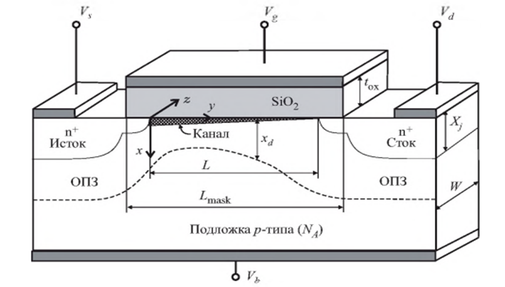
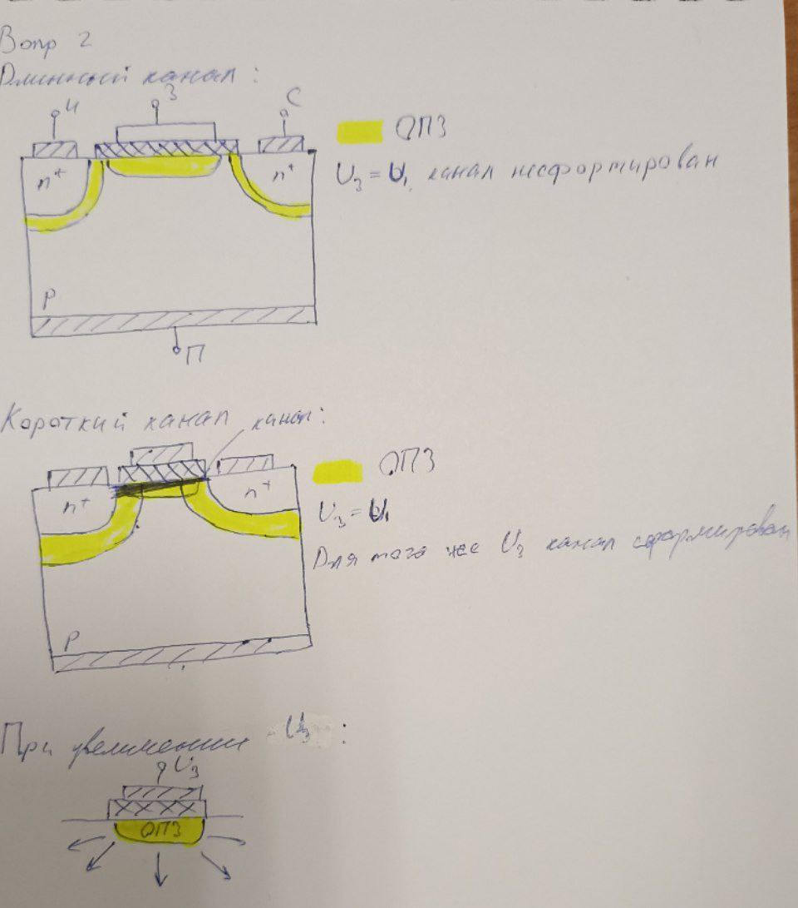
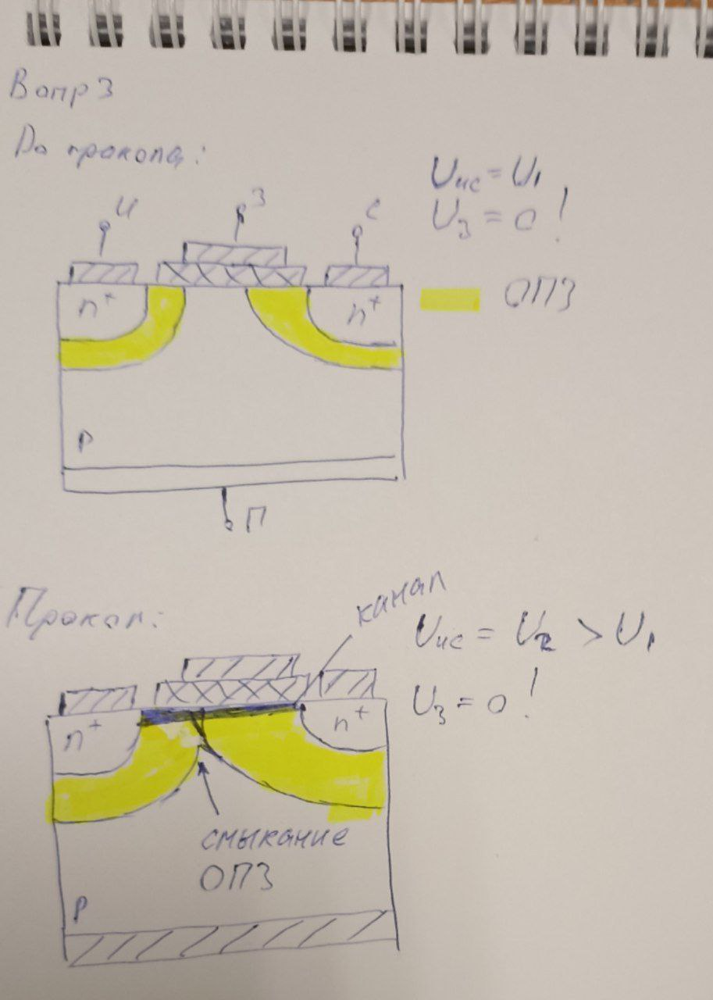

# Общие сведения

{height=300}

## Синонимы:

- Канал - инверсный слой 
  
- ОПЗ - ОО (область пространственного заряда - обедненная область) 

# Список эффектов

## 2. Перекрытие обедненных областей истока и стока

В длинноканальном транзисторе заряд под затвором представляет собой сумму зарядов областей пространственного заряда р-n-переходов и области обеднения под затвором. При уменьшении длины канала все три области пространственных зарядов перекрываются, поэтому для обеспечения той же величины суммарного заряда под затвором, что и в длинноканальном транзисторе (при неизменном заряде затвора), заряд инверсионного слоя короткоканального транзистора должен быть больше, т. е. пороговое напряжение уменьшается. 

Другими словами - нужно приложить меньшее по модулю напряжение на затвор короткоканального транзистора, чтобы образовался канал.

Описанный эффект является существенно двумерным, что усложняет уравнения компактной модели, в том числе зависимость характеристик от длины канала

{height=300}

## 3. Прокол между истоком и стоком

Если МОП-транзистор заперт, а напряжение на его стоке возрастает, то область пространственного заряда стока распространяется в сторону истока. Поскольку концентрация примеси в канале обычно выше, чем в подложке, в глубине структуры область пространственного заряда оказывается больше, чем в области канала и она может достичь истока. При этом практически исчезает потенциальный барьер между стоком и истоком и появляется ток стока, не управляемый напряжением на затворе. Для устранения этого эффекта в процессе изготовления транзистора нужно соблюдать технологические ограничения.

{height=300}