# Общие сведения

{height=300}

## Синонимы:

- Канал - инверсный слой 
  
- ОПЗ - ОО (область пространственного заряда - обедненная область) 

# Список эффектов

## 1. Модуляция длины канала (CLM)

#q - вставить из файла

[BSIM Channel Length Modulation (CLM)](https://class.ece.iastate.edu/djchen/ee501/BSIM470_Manual.pdf#page=41)

## 2. Перекрытие обедненных областей истока и стока

В длинноканальном транзисторе заряд под затвором представляет собой сумму зарядов областей пространственного заряда р-n-переходов и области обеднения под затвором. При уменьшении длины канала все три области пространственных зарядов перекрываются, поэтому для обеспечения той же величины суммарного заряда под затвором, что и в длинноканальном транзисторе (при неизменном заряде затвора), заряд инверсионного слоя короткоканального транзистора должен быть больше, т. е. пороговое напряжение уменьшается. 

Другими словами - нужно приложить меньшее по модулю напряжение на затвор короткоканального транзистора, чтобы образовался канал.

Описанный эффект является существенно двумерным, что усложняет уравнения компактной модели, в том числе зависимость характеристик от длины канала

{height=300}

## 3. Прокол между истоком и стоком

Если МОП-транзистор заперт, а напряжение на его стоке возрастает, то область пространственного заряда стока распространяется в сторону истока. Поскольку концентрация примеси в канале обычно выше, чем в подложке, в глубине структуры область пространственного заряда оказывается больше, чем в области канала и она может достичь истока. При этом практически исчезает потенциальный барьер между стоком и истоком и появляется ток стока, не управляемый напряжением на затворе. Для устранения этого эффекта в процессе изготовления транзистора нужно соблюдать технологические ограничения.

{height=300}

## 4. Эффект короткого канала.

В длинноканальных транзисторах величина порогового напряжения не зависит от длины канала. С уменьшением длины канала изменяется конфигурация двумерного электрического поля объемного заряда в подложке за счет сближения областей пространственного заряда истока и стока, при этом увеличивается средняя напряженность поля под затвором. Это приводит к увеличению модуля поверхностного потенциала и, следовательно, снижению порогового напряжения при уменьшении длины канала (рис. ниже, кривая а). Этот эффект называется «эффектом короткого канала». 

В некоторых транзисторах при уменьшении длины канала пороговое напряжение сначала возрастает, затем убывает. Рост порогового напряжения с уменьшением длины канала называют обратным эффектом короткого канала. На соответствующем графике (рис. ниже кривая б) появляется «холмик».

Этот эффект имеет следующее объяснение. При изготовлении транзисторов с поликремниевым затвором на краях затвора возникают механические напряжения. Эти напряжения приводят к появлению точечных дефектов в подложке по краям затвора, которые собирают примеси из подложки в процессе дальнейшей термической обработки. В результате в канале по краям затвора появляются две области с повышенной концентрацией примеси. При уменьшении длины канала эти области сближаются и увеличивается их вклад в среднюю концентрацию примеси в канале. Поэтому сначала наблюдается увеличение порогового напряжения. Далее основной эффект – сближение обедненных областей истока и стока – становится преобладающим и пороговое напряжение падает.

[BSIM Short-Channel and DIBL Effects](https://class.ece.iastate.edu/djchen/ee501/BSIM470_Manual.pdf#page=23)

## 5. Эффект узкого канала.

На рисунке приведен поперечный разрез МДП-транзистора с узким каналом. В этом случае напряжение на затворе формирует тонкую обедненную область под толстым диэлектриком и толстый обедненный слой под тонким диэлектриком. В отличие от идеального случая в реальном случае граница обедненной области имеет форму, близкую к параболической. При увеличении напряжения на затворе $U_{GS}$ возрастают обедненная область под толстым окислом у МДП-транзистора с узким каналом и доля пространственного заряда, выходящего за границы, определяемые затвором, становится существенна по сравнению с общим зарядом под затвором. Вследствие закона сохранения заряда при том же напряжении на затворе $U_{GS}$ доля заряда, находящегося под затвором, то есть в области канала, уменьшается на величину заряда, выходящего за границы затвора. Это приводит к увеличению порогового напряжения.
 
Чем больше соотношение толщин между толстым и тонким окислом, тем больше область перехода и тем выше пороговое напряжение. Чем ýже канал, тем больше изменения порогового напряжения. В пределе, когда ширина канала стремится к нулю, пороговое напряжение приближается к пороговому напряжению для структур с толстым окислом.

[BSIM Narrow-Width Effect](https://class.ece.iastate.edu/djchen/ee501/BSIM470_Manual.pdf#page=25)

## 6. Обратный эффект узкого канала.

[BSIM Narrow-Width Effect](https://class.ece.iastate.edu/djchen/ee501/BSIM470_Manual.pdf#page=25)

## 7. Уменьшение подвижности вследствие вертикальной компоненты электрического поля.

Малая толщина подзатворного диэлектрика субмикронных транзисторов и наноразмерных приборах (несколько нанометров) приводит к увеличению напряженности вертикальной компоненты электрического поля под затвором до величины, когда происходит уменьшение подвижности вследствие рассеяния носителей на шероховатости поверхности, фононах и на неподвижных зарядах вблизи поверхности (кулоновское рассеяние). Эффект уменьшения подвижности, не учитываемый в транзисторах с толстым диэлектриком, приводит к тому, что вольтамперная характеристика в области насыщения перестает быть квадратичной и стремится к линейной.

При моделировании эффекта уменьшения подвижности вследствие вертикальной компоненты электрического поля, отдельно рассчитывается вклад каждого механизма рассеяния. Также при переходе от моделирования субмикронных приборов к моделированию наноразмерных транзисторов появляется сильное расхождение рассчитываемой зависимости и экспериментальной (рисунок ниже). Например, влияние вертикальной компоненты электрического поля в субмикронных приборах с хорошей точностью описывает диффузионно-дрейфовая модель Дарвиша. В этой модели вклад, обусловленный рассеянием на акустических фононах:

#q1

Однако, для точного описания работы наноразмерных приборов данная модель требует введения корректирующих коэффициентов. Тогда выражения, учитывающие рассеяние на акустических фононах примет вид:

#q2

### ссылки 

Чан Туан Чунг, Боровик А.М., Стемпицкий В.Р. Оптимизация параметров диффузионно-дрейфовой модели // Доклады БГУИР. 2014. №8 (86). URL: https://cyberleninka.ru/article/n/optimizatsiya-parametrov-diffuzionno-dreyfovoy-modeli (дата обращения: 10.12.2023).

[BSIM Unified Mobility Model (5.12)](https://class.ece.iastate.edu/djchen/ee501/BSIM470_Manual.pdf#page=42)

## 8. Уменьшение продольной подвижности (насыщение дрейфовой скорости носителей в канале).

#q

[BSIM Velocity Saturation](https://class.ece.iastate.edu/djchen/ee501/BSIM470_Manual.pdf#page=46)

## 9. Аномальный рост подвижности.

Особенности транспорта носителей заряда в твердотельных структурах во многом определяются процессами их рассеяния при движении из одной области структуры в другую. Электрон, сталкиваясь с другим электроном или рассеиваясь на колебаниях решетки, дефектах либо границе раздела, неизбежно изменяет свое состояние. Среднее расстояние, которое электрон проходит между двумя последовательными актами рассеяния, называют средней длиной свободного пробега.
В структурах с размером меньше длины свободного пробега перенос носителей заряда происходит без их рассеяния. Такой перенос называют баллистическим транспортом (ballistic transport). Вследствие отсутствия рассеяния предполагаемые характеристики возможного будущего прибора (в частности подвижности и проводимости) будут много лучше. 
В металлах средняя длина свободного пробега электронов даже при низких температурах обычно не превышает 10 нм, что соответствует размерам типичных наноструктур или даже меньше их. По этой причине баллистический транспорт в металлических наноструктурах реализуется с трудом. При комнатной температуре средняя длина свободного пробега электронов при неупругом рассеянии достигает 50-100 нм в Si и около 120 нм в GaAs. Очевидно, что в наноструктурах из полупроводников баллистический транспорт легко реализуется.
Идеальный баллистический транспорт носителей заряда в наноструктурах характеризуется универсальной баллистической проводимостью (universal ballistic conductance), которая не зависит от типа материала и определяется лишь фундаментальными константами.
Проводимость квантового шнура (проводимость идеального одномерного проводника в баллистическом режиме) определяется только фундаментальными константами и определяется выражением:

#q

Следует помнить, что в случае, когда проводящий канал не является идеальным, процессы рассеяния носителей заряда приводят к уменьшению тока, поскольку вероятность переноса носителей заряда становится меньше единицы. Это необходимо учитывать при расчете проводимости канала.

[BSIM  Source End Velocity Limit Model](https://class.ece.iastate.edu/djchen/ee501/BSIM470_Manual.pdf#page=54)

## 10. Подпороговая проводимость.

При уменьшении размеров транзистора необходимо одновременно снижать рабочее напряжение на стоке и затворе, чтобы напряженность поля в канале и удельная мощность рассеяния не росли. Однако с точки зрения схемотехники, для оптимального режима работы транзистора необходимо уменьшать и пороговое напряжение, а это приводит к росту среднего значения подпорогового тока. Подпороговый ток для многих СБИС определяет величину потребляемой мощности, поэтому его моделирование становится более актуальным, чем для транзисторов с длинным каналом.
Подпороговая проводимость возникает в результате появления слабой инверсии в приповерхностном слое полупроводника при напряжении на затворе меньше порогового  $U_{gs}<U_{th}$ и предшествует образованию канала. В это области подпороговой проводимости в отличие от области сильной инверсии, где происходит образование канала, преобладает диффузионный, а не дрейфовый ток. На управляющей характеристике участку подпороговой проводимости соответствует начальная область зависимости, которая в логарифмическом масштаба близка к линейной (рисунок ниже).

[BSIM Subthreshold Swing n](https://class.ece.iastate.edu/djchen/ee501/BSIM470_Manual.pdf#page=31)

## 11. Последовательные сопротивления истока и стока.

#q

## 12. Снижение потенциального барьера под затвором, вызванное напряжением на стоке (DIBL-эффект)

Снижение потенциального барьера под затвором, вызванное напряжением на стоке (DIBL-эффект). Вследствие того, что двумерная область пространственного заряда стокового p-n-перехода с ростом напряжения на стоке приближается к истоку, увеличение напряжения на стоке приводит к увеличению среднего значения вертикальной составляющей напряженности поля под затвором. Это эквивалентно уменьшению порогового напряжения и приводит к уменьшению дифференциального сопротивления стока в области насыщения (DIBL-эффект — Drain Induced Barier Lowering). DIBL-эффект снижает также потенциальный барьер р-п-перехода истока, увеличивая тем самым ток инжекции электронов из истока в подпороговой области.

Физические механизмы, стоящие за эффектом короткого канала и эффектом DIBL могут быть описаны с помощью рис. 1. Высоты электронного барьера (в n-МОП) вдоль канала для устройств с длинным каналом и коротким каналом показаны на рис. 1. Высота барьера устройства с длинным каналом почти не чувствительна к напряжению стока. Однако высота барьера устройства с коротким каналом существенно уменьшается за счет напряжения стока. Даже когда напряжение стока равно нулю, высота барьера устройства с коротким каналом ниже, чем у устройства с длинным каналом. Уменьшение высоты барьера приведет к снижению порогового напряжения. Вот почему пороговое напряжение устройства с коротким каналом меньше, чем у устройства с длинным каналом; и именно поэтому пороговое напряжение устройства с коротким каналом является сильной функцией напряжения стока.

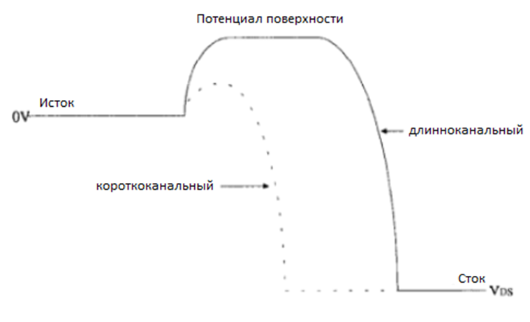

DIBL-эффект вызывает уменьшение Uпор из-за снижения потенциального барьера в канале. Это физический эффект, который обычно рассматривается только тогда, когда Uз ≤ Uпор. Однако, когда Uз>Uпор, все равно происходит снижение Uпор из-за электростатической связи между стоком и каналом, как если бы сток служил нежелательным дополнительным затвором. Из-за этого влияние DIBL на Uпор имеет место, когда Uз>Uпор.

[BSIM  Drain-Induced Barrier Lowering (DIBL)](https://class.ece.iastate.edu/djchen/ee501/BSIM470_Manual.pdf#page=50)

## 13. Статическая обратная связь.

#q

## 14. Влияние горячих носителей заряда.

Уменьшение длины канала транзисторов происходит быстрее, чем снижение рабочего напряжения на стоке, поэтому напряженность электрического поля в канале вблизи стока увеличивается. Это приводит к росту энергии носителей в области отсечки канала. Кроме того, при увеличении напряженности поля происходит увеличение статистического разброса энергии носителей. При этом некоторые носители заряда достигают энергии, достаточной для генерации электронно-дырочных пар по механизму ударной ионизации. Появившиеся в результате генерации дырки уходят в подложку, а электроны приобретают энергию, достаточную для инжекции в окисел. Инжекция горячих электронов в окисел приводит к увеличению плотности поверхностных состояний и зарядке окисла. В результате происходит увеличение подпорогового тока и сдвиг порогового напряжения, то есть долговременная нестабильность характеристик и снижение надежности ИС. 

Второй эффект, связанный с горячими электронами, состоит в том, что часть дырок, появившихся в результате ударной ионизации, скапливается у истока, снижая потенциальный барьер истокового p-n-перехода, который начинает работать как эмиттер биполярного транзистора. В результате появляется дополнительный ток стока, равный току коллектора продольного биполярного n-p-n-транзистора.

Для устранения описанного эффекта выполняют расширение областей истока и стока в направлении канала путем создания LDD-структуры с концентрацией примеси от 4*1018 до 8*1018 см–3, а также уменьшают напряжение питания ИС.

## 15. Эффект влияния подложки, вызванный ее током (SCBE).

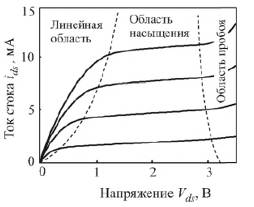

При уменьшении размеров транзистора и увеличении напряжения на стоке возрастает напряженность поля в стоковом p-n-переходе и когда она достигает значений более 0,1 МВ/см, электроны, попадающие в эту область из канала, приобретают энергию, достаточную для ударной ионизации атомов кремния с образованием электронно-дырочных пар. Таким образом, образовавшиеся электроны уходят в область стока, а дырки – в подложку. Основная часть дырок собирается выводом подложки, меньшая часть рекомбинирует с электронами, которые инжектируются из p-n-перехода истока. Другими словами, к току стока добавляется компонента, вызванная ударной ионизацией, что приводит к резкому изгибанию стоковых характеристик вверх в области больших напряжений на стоке (рисунок 1). Падение напряжения на омическом сопротивлении подложки, вызванное током ударной ионизации, вызывает небольшое смещение подложки относительно стока.
На рисунке 2 показаны физические принципы генерации тока подложки за счет ударной ионизации в n-канальном МОП-транзисторе.

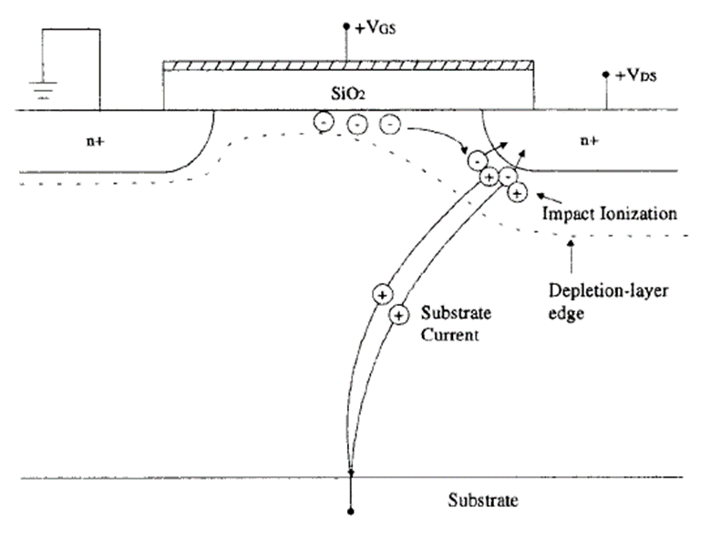

Это приводит к увеличению тока стока, который во много раз превышает ток подложки I_sub, как показано на рисунке 3.

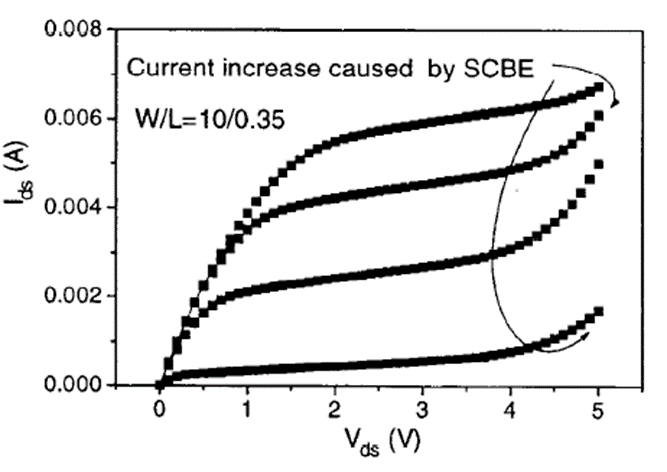

[BSIM  Substrate Current Induced Body Effect (SCBE)](https://class.ece.iastate.edu/djchen/ee501/BSIM470_Manual.pdf#page=51)

## 16. Влияние сопротивления подложки.

При низких частотах сопротивление подложки в транзисторе можно не учитывать. Но уже начиная от радиочастот сопротивление подложки оказывает значительное влияние на работу транзистора.

Сопротивление подложки сильно зависит от топологии МОП-транзистора. На рисунке 1 представлена схема, которая позволяет достаточно точно моделировать сопротивление подложки до частот 10 ГГц

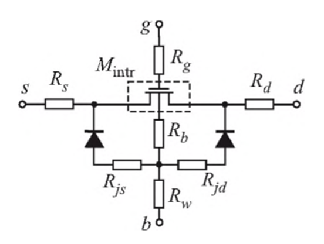

Сопротивление подложки играет существенную роль при анализе высокочастотных цепей. Чем выше частота, тем выше емкостные токи, протекающие через подложку. Так же через сопротивление подложки реализуется паразитная обратная связь между транзисторами в ИС. С уменьшением размеров транзистора, роль этого сопротивление возрастает, поскольку с уменьшение площади транзистора увеличивается сопротивление растекания тока подложки.

### ссылки

При желание подробнее можно прочитать про эти эффекты в статье наших азиатских коллег по ссылке: 

https://pure.hw.ac.uk/ws/portalfiles/portal/24395914/A_Simple_and_Accurate_Method_for_Extracting_Super_Wideband_Electrical_Properties_of_the_Printed_Circuit_Board_IEEE_Access2019.pdf

## 17. Ток утечки, индуцированный затвором (GIDL/GISL).

Рост напряженности электрического поля в кремнии приводит к обеднению носителями приповерхностного участка сильно легированной области стока, обуславливая при этом интенсификацию термической генерации носителей, ограничиваемой их переносом. Возникающий в этом случае ток утечки экспоненциально зависит от напряжения на затворе относительно стока – в отличие от обычного теплового тока утечки через p-n-переход. При еще большей величине напряженности электрического поля изгиб энергетических зон может увеличиться настолько, что возникнет межзонный туннельный ток на поверхности сильно обедненной области стока, перекрытой затвором. Указанный механизм генерации тока утечки, индуцированного напряжением на затворе, называют GIDL-эффектом (Gate-induced Drain Leakage). При еще больших электрических полях ток утечки между затвором и стоком обеспечивается комбинацией двух процессов: туннелированием электронов из затвора в сток и инжекцией горячих дырок, генерируемых GIDL-эффектом, в подзатворный диэлектрик. Этот ток, протекающий между затвором и стоком транзистора в закрытом состоянии, приводит к значительному захвату дырок в подзатворном окисном слое, что вызывает аномальное поведение тока стока и деградацию подзатворного окисного слоя.

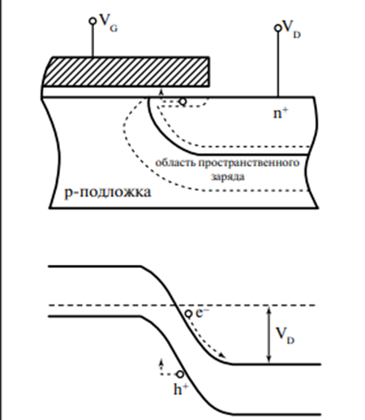

Упомянутые выше токи утечки очень чувствительны к толщине подзатворного окисного слоя, концентрации легирующей примеси в области стока и прикладываемому напряжению между стоком и затвором.

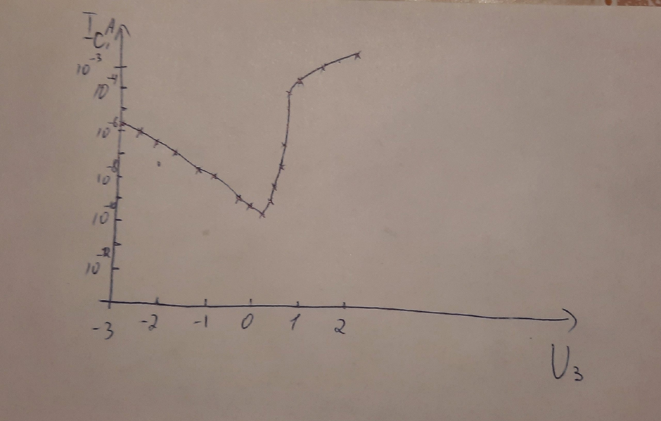

[BSIM Body Current Models](https://class.ece.iastate.edu/djchen/ee501/BSIM470_Manual.pdf#page=56)

## 18. Эффект обеднения в поликремниевом затворе.

## 19. Эффект квантования инверсионного слоя.

Современные МОП-транзисторы имеют размеры порядка десятка нанометров. В качестве материала затвора используют сильнолегированный поликремний. В качестве диэлектрической подложки используют оксид кремния SiO2. При этом, для эффективного управления каналом (инверсным слоем) МОП-транзистора толщина окисла глубоко субмикронных структур должна составлять величину порядка десятков нанометров, при этом должна быть увеличена концентрация примеси в подложке до величин порядка 〖10〗^18  см^(-3). Однако, это уменьшает толщину области пространственного заряда и одновременно увеличивает напряженного электрического поля у поверхности. Это приводит к тому, что потенциальная яма становится настолько узкой, что пренебречь квантовомеханической природой электронного газа становиться невозможно. Инверсионный слой действует как квантовый колодец для электронов. Потенциальные стенки колодца с одной стороны образованы границей диэлектрик/полупроводник, а с другой стороны – электрическим полем, которое прижимает электроны к этой границе. Ввиду малой ширины колодца в нем формируется двумерный электронный газ. В результате разрешенные энергетические состояния электрона в яме также оказываются дискретными. Следствием этого является ненулевая минимальная энергия электрона в потенциальной яме. Конечное ненулевое минимальное значение энергии электронов и дискретность разрешенных энергетических состояний, возникающие как следствие квантово-волнового поведения электрона в замкнутом пространстве, составляют суть эффекта квантового ограничения. 

При этом первый дискретный уровень возникает на расстоянии ∆E от дна зоны проводимости, поэтому максимум плотности пространственного распределения электронов в n-канале находится не у границы раздела с окислом, а на расстоянии примерно 1 нм, что приводит к увеличении эффективной толщины диэлектрика, уменьшению емкости затвора и нагрузочной способности транзистора, а также к увеличению напряжения отсечки. На рисунке 2 изображена энергетическая диаграмма с учетом квантования инверсного слоя. А на рисунке 3 представлены распределения электронной плотности в n-канале с учетом квантования и без. 

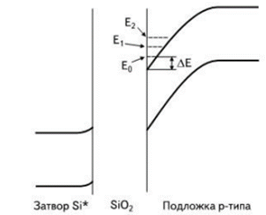

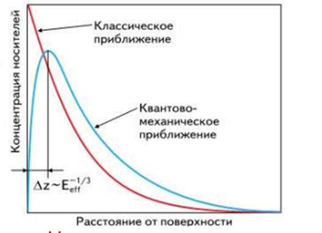

## 20. Эффект неоднородного легирования.

При изготовлении МОП-транзисторов с коротким каналом для получения необходимого значения порогового напряжения, снижения влияния горячих электронов и предотвращения эффекта смыкания истока со стоком используется неоднородное легирование методом ионной имплантации. Неоднородность может быть как в вертикальном, так и в продольном (вдоль канала) направлении (см. п. 2.1.2). При этом усложняется выражение для коэффициента влияния подложки, и он перестает быть константой.

Неоднородное легирование дает:
•	Подавление короткоканальных эффектов
•	Уменьшение емкости р-n перехода

2.1.2. Методы улучшения характеристик. 
Уменьшение порогового напряжения при снижении длины канала является индикатором появления короткоканальных эффектов и существенным препятствием на пути сокращения размеров транзисторных структур. Для борьбы с эффектами короткого канала используется изменение профиля легирующей примеси как в горизонтальном, так и в вертикальном направлении. В горизонтальном направлении (вдоль канала) создают ореол (halo) вокруг слаболегированных областей истока и стока (рис. 2.1), выполняют ионную имплантацию в кармашки (pockets). В вертикальном направлении создают неоднородное (ретроградное) распределение примеси в кармашках, экстремально мелкие области истока и стока, применяют новые материалы с большей, чем у SiO2, диэлектрической проницаемостью.

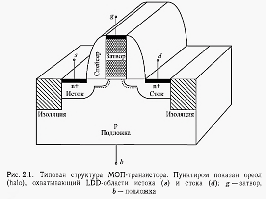

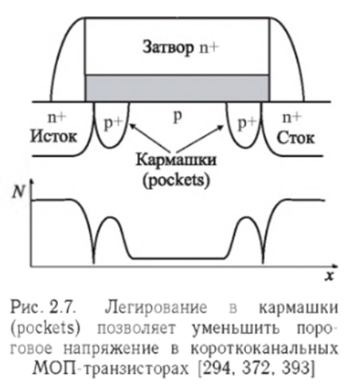

Проникновение области обеднения стока в канал является основной причиной появления короткоканальных эффектов. Однако их нельзя устранить путем простого повышения концентрации легирующей примеси в подложке, поскольку при этом растет подпороговый ток и уменьшается подвижность носителей в канале, вызывающая деградацию нагрузочной способности транзистора. Наиболее распространенным решением этой проблемы является реализация так называемого обратного эффекта короткого канала, когда с уменьшением длины канала пороговое напряжение возрастает. Этого можно достичь применением ореола (halo) вокруг областей истока и стока (см. рис. 2.1).

**Как делается ореол**: ореол создается ионным легированием примеси того же типа проводимости, что и карман (бор или индий для п-канального транзистора и мышьяк для р-канального). Для создания ореола ионное легирование выполняется вертикально или под углом, для чего кремниевую пластину наклоняют на угол от 20-30 до 90° по отношению к ионному пучку, чтобы направить его под затвор. Ореол делают обычно на том же этапе литографии, что и мелкие слаболегированные области истока и стока. Энергию имплантации выбирают достаточно большой, чтобы увеличить глубину залегания ореола. После формирования спейсера во время отжига областей истока и стока, имплантант диффундирует за LDD-области, обеспечивая показанный на рис. 2.5 профиль распределения примеси.

**Принцип действия ореола** основан на том, что пороговое напряжение МОП-транзистора зависит от средней концентрации примеси под затвором, а не от ее горизонтального распределения. Поэтому введение ореола увеличивает пороговое напряжение, однако практически не влияет на среднюю подвижность носителей в канале. Ионное легирование в кармашки (pocket) отличается от ореола только тем, что охватывает не всю LDD-область, а только ее часть у поверхности или снизу (рис. 2.7). 

**Как делается ретроградное распределение**: крутое ретроградное распределение примеси (SSRW) (рис. 2.6) создается путем медленной диффузии мышьяка или сурьмы для р-канальных приборов и индия для п-канальных. Благодаря возможности устанавливать поверхностную концентрацию легирующей примеси независимо от объемной, появляется дополнительная степень свободы для независимой регулировки порогового напряжения и концентрации примеси в подложке, влияющей на величину области пространственного заряда и, соответственно, короткоканальные эффекты. Правильное применение идеи SSRW позволяет ослабить влияние короткоканальных эффектов и увеличить поверхностную подвижность носителей, однако при этом несколько увеличивается подпороговый ток

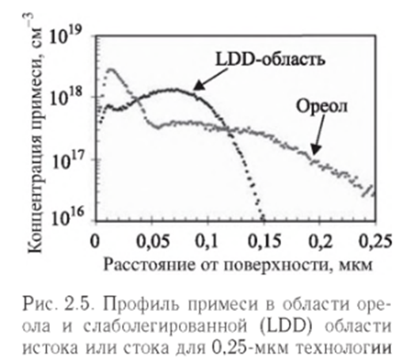

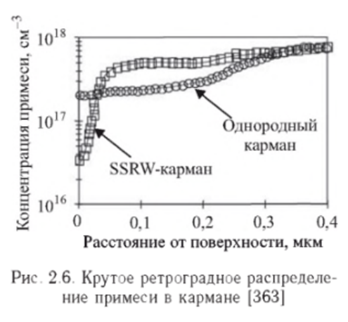

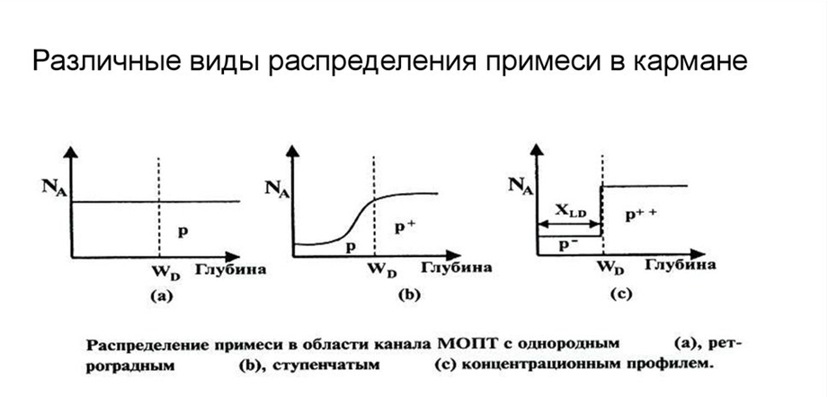

## 21. Ток туннелирования через затвор.

Считалось, что в длинноканальных МОП-транзисторах ток затвора равен нулю, поскольку он отделен от подложки слоем окисла кремния. Однако с уменьшением размеров транзистора толщина окисла становится настолько малой (менее 5 нм), что туннельный ток через затвор становится существенным. Вероятность туннелирования экспоненциально растет с уменьшением толщины окисла tox. 

При толщине окисла под затвором менее З нм уже нельзя пренебречь прямым прохождением тока через затвор за счет туннельного эффекта. Носителями тока могут быть как электроны, так и дырки, в зависимости от режима работы транзистора и типа легирования канала.

Зонная диаграмма, объясняющая возникновение туннельного тока, показана на рис. 9. Здесь Vox — падение напряжения на окисле, Vox = Qg/Cox; χ_b — потенциальный барьер для электронов на границе Si–SiO2; jg — плотность туннельного тока электронов зоны проводимости через окисел из инверсионного слоя в поликремниевый затвор.

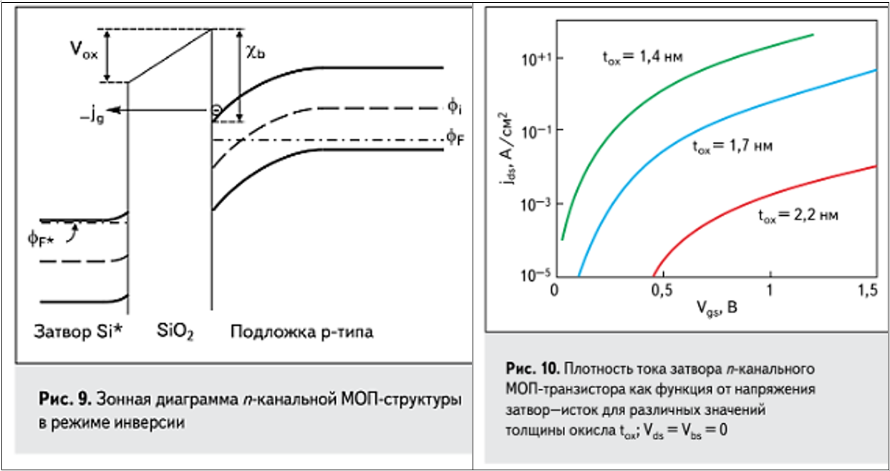

В режиме, когда напряжение на затворе n-канального транзистора равно нулю, а на стоке — максимально, область стока под перекрытием затвор-сток обедняется электронами. Поскольку область стока легирована сильно, область обеднения имеет очень маленькую ширину и становится возможным туннелирование электронов из валентной зоны в зону проводимости n+ стока. Возникающий таким образом механизм генерации электронов и дырок приводит к возникновению тока утечки между стоком и подложкой, вызванного затвором (Gate-Induced Drain Leakage, GIDL-эффект).

Плотность туннельного тока пропорциональна количеству электронов на единицу площади поверхности N и вероятности Ptun туннелирования электронов в секунду. График зависимости тока затвора от напряжения затвор–исток показан на рис. 10. Плотность тока примерно экспоненциально возрастает с уменьшением толщины окисла.

Туннельный ток затвора протекает в подложку (Igb), а также в области истока и стока через канал (Igs, Igd) и через области перекрытия (Igov), рис. 11.

Для снижения туннельного тока вместо традиционного SiO2 используют диэлектрики с высокой диэлектрической проницаемостью (high-k dielectric), которые позволяют увеличить толщину диэлектрика при сохранении удельной крутизны транзистора.

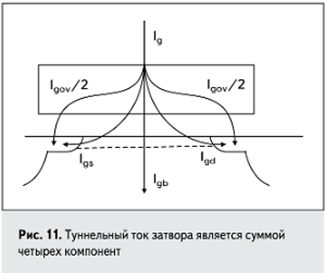

## 22. Динамический сдвиг порогового напряжения.

#q

## 23. Туннелирование через p-n-переходы (ТАТ).

Идеального переключения транзистора практически сложно достичь, всегда будут присутствовать токи утечки из затвора или подложки и обусловленный туннелированием через ловушки ток. 

Ток туннелирования через ловушки (trap assisted tunneling, TAT) на границе оксид-полупроводник, известен как механизм тока утечки в обычных диодах с p–n-переходом. Он обусловлен эмиссией электронов в ловушечное состояние за счёт электрон-фононного взаимодействия с последующим туннелированием в зону проводимости. Аналогичным образом возможна эмиссия дырок и туннелирование через ловушки. Этот процесс сильно зависит от температуры.

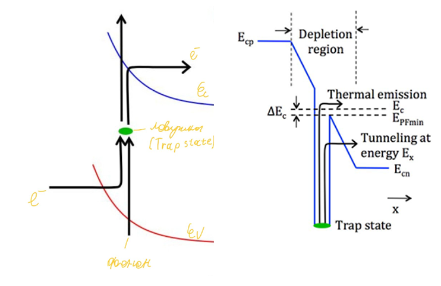

[BSIM Equations for Tunneling Currents](https://class.ece.iastate.edu/djchen/ee501/BSIM470_Manual.pdf#page=35)

## 24. Неквазистатический эффект.

## 25. Эффект саморазогрева.

Рассеивание тепла является критической проблемой при проектировании схем. Возможно, потребуется учитывать повышение температуры, вызванное энергопотреблением устройств в кристалле, поскольку плотность устройств в современных СБИС-схемах стала огромной.

Скрытый окисел сильно затрудняет отвод тепла в подложку. В результате КНИ структуры обладают большими тепловыми постоянными времени, и для них типичны эффекты т.н. саморазогрева. Повышение температуры функционирования из-за омического тепловыделения при больших токах приводит к снижению подвижности.

Мощность, выделяемая в транзисторе, быстро рассеивается через подложку, которая имеет низкое тепловое сопротивление благодаря высокой теплопроводности кремния. Однако для транзисторов типа КНИ (SOI), а также транзисторов, изготовленных с технологическими нормами менее 0,1мкм, саморазогрев играет существенную роль и может приводить к уменьшению тока стока при больших значениях тока. В результате может появиться отрицательная дифференциальная проводимость сток–исток при большом напряжении и токе, когда в канале выделяется большая мощность.

Обычно, рост температуры включающий эффект саморазогрева в устройстве, может быть описано выражением:
$$T_c = T_0 + R_{th} I_d V_{ds}$$,
где $I_d$ и $U_{ds}$ – ток стока и напряжение стока, R_{th} – тепловое сопротивление T0 - температура окружающей среды. 

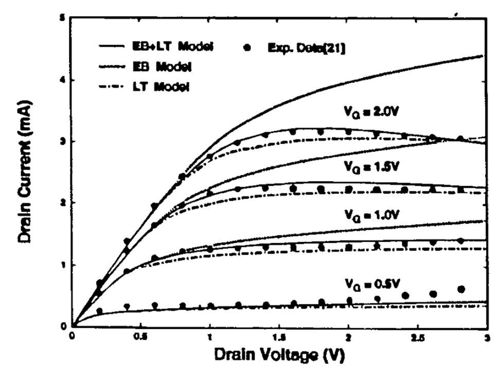

На рисунке 1 показана выходная ВАХ транзистора, где наглядно видно уменьшение тока стока при большом напряжении на стоке (отрицательная выходная проводимость).

#q

где $I_{ds0}$ = Ток при температуре окружающей среды (T = T0), χ зависит от толщины оксидной подложки, толщины оксида затвора, толщины пленки кремния и приложенного напряжения смещения.

## 26. Учет перекрытия затвором областей истока и стока.

При снижении размеров увеличивается относительный технологический разброс геометрических размеров транзистора, поэтому влияние емкостей перекрытий затвор–сток и затвор–исток увеличивается. Кроме того, эти емкости необходимо учитывать как нелинейные n+-SiO2-n+ МОП-емкости. При некотором напряжении между затвором и истоком (стоком) в этих областях формируется тонкий поверхностный слой с накоплением подвижного заряда и более толстый положительно заряженный обедненный слой, что учитывается с помощью моделей нелинейных МОП-емкостей перекрытий.

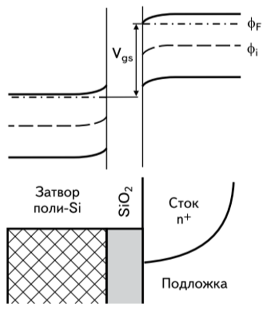

#q

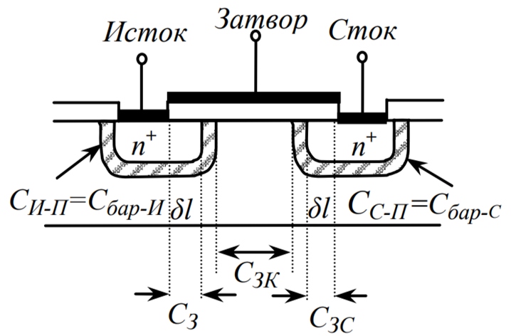

[BSIM Overlap capacitance model](https://class.ece.iastate.edu/djchen/ee501/BSIM470_Manual.pdf#page=76)

## 27. Эффект близости кармана (WPE).

Глубоко субмикронные технологии требуют ионной имплантации атомов примеси с высокой энергией для формирования ретроградного (при ретроградном (обратном) профиле распределения примеси концентрация примеси у поверхности меньше, чем в объеме полупроводника.) профиля примеси в подложке с целью предотвращения защелкивания паразитного продольного биполярного транзистора и эффекта прокола между истоком и стоком. Во время имплантации атомы, летящие по нормали к поверхности, рассеиваются от границ маски фоторезиста под разными углами, в том числе почти в горизонтальном направлении, и встраиваются в поверхность кремния вблизи от краев кармана. 

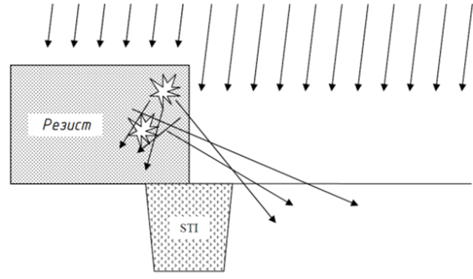

В результате увеличивается концентрация примеси у поверхности, на расстоянии до 1 мкм от краев кармана, что вызывает увеличение порогового напряжения.

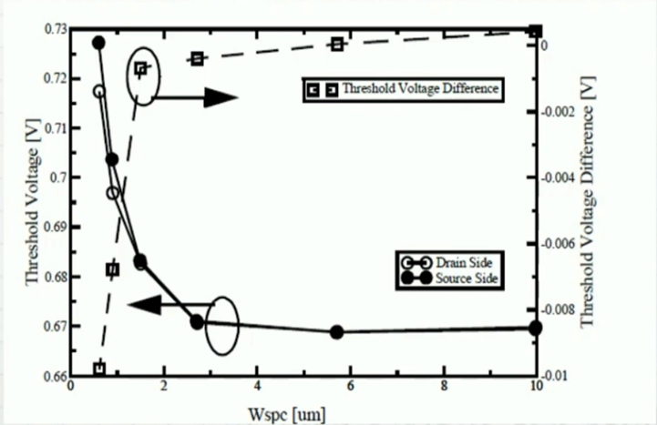

Рабочая точка транзистора в аналоговых схемах может быть сдвинута на 20–30 %, что часто приводит к потере работоспособности аналоговых ИС.

Чтобы избежать этого эффекта можно увеличить расстояние от транзистора до края кармана.

## 28. Эффект влияния изоляции мелкими канавками (STE).